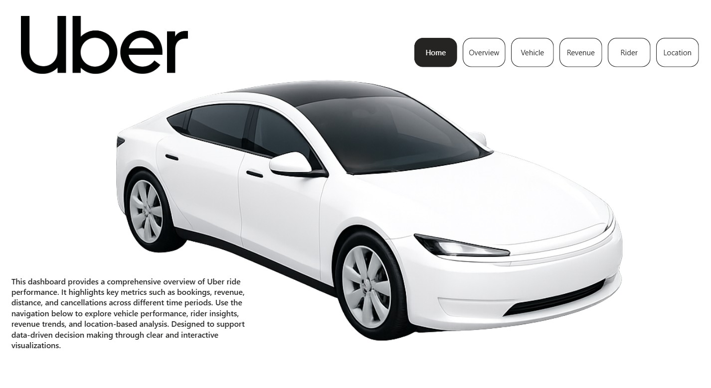
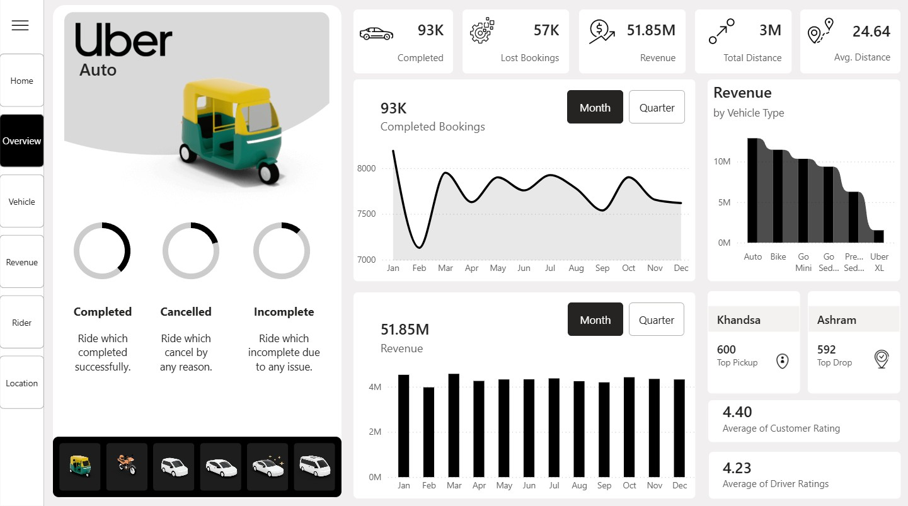
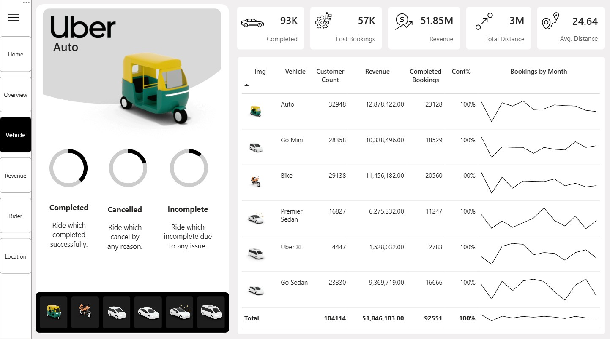
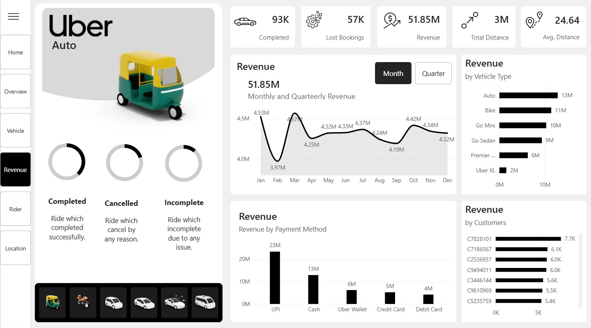
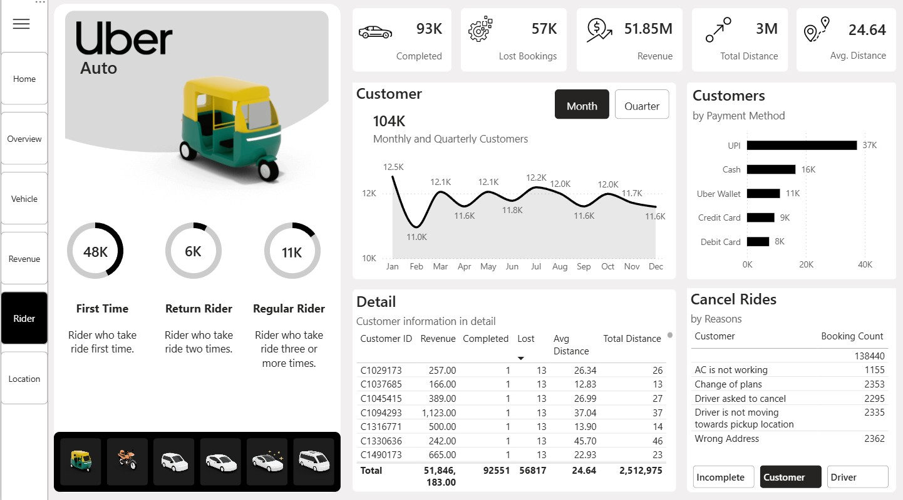
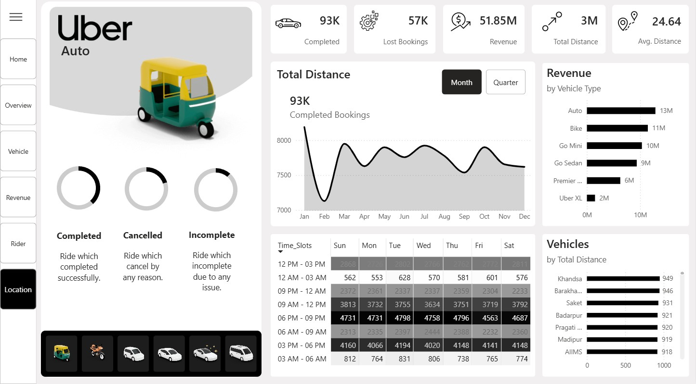

# Uber Operations & Revenue Intelligence Dashboard

## 📊 Executive Project Overview
This enterprise-level **Uber Operations Analytics Dashboard** provides a deep-dive performance review of a multi-vehicle fleet (Auto, Bike, Go Mini, Go Sedan, Premier Sedan, Uber XL). Analyzing over **93,000 completed bookings** generating **$51.85M in gross revenue**, this strategic tool enables operational managers to optimize asset utilization, track demand velocity across hourly intervals, mitigate ride cancellations, and maximize overall customer lifetime value.

### 🔗 Interactive Live Link
* [👉 Click Here to Interactively Explore the Uber Report](YOUR_POWER_BI_SERVICE_OR_NOVYPRO_LINK) *

---

## 🗺️ Multi-Page Architecture & Core Insights

### 1. Landing Page (`Home.jpg`)
* **Purpose:** A clean corporate portal utilizing high-fidelity 3D rendering to guide executive stakeholders into distinct operational reporting tracks via customized navigational buttons.

<p align="center">
  
</p>

### 2. Operational Overview (`Overview.jpg`)
* **Core KPIs:** High-level tracking of **Completed Bookings (93K)**, **Lost Bookings (57K)**, **Total Revenue ($51.85M)**, **Total Distance (3M km)**, and **Average Distance (24.64 km)**.
* **Granular Tracking:** Maps historical trends across a rolling calendar while isolating high-performing zones such as **Khandsa** (Top Pickup Location) and **Ashram** (Top Drop-off Location).

<p align="center">
  
</p>

### 3. Fleet & Vehicle Utilization (`Vehicle.jpg`)
* **Performance Matrix:** Breaks down total bookings by type, showing **Uber Auto** leading volume with 32,948 customer counts, closely followed by **Go Mini** (28,358).
* **Sparkline Analytics:** Leverages inline micro-trend charts to evaluate monthly booking consistency across distinct product variants.

<p align="center">
  
</p>

### 4. Revenue Intelligence (`Revenue.jpg`)
* **Payment Ecosystem:** Tracks transactional inflows by method, identifying **UPI** as the primary revenue channel ($23M) over traditional cash or wallet distributions.
* **Customer Spending Concentration:** Features a Pareto-focused rank chart displaying top-spending customer tiers to identify high-value consumer groups.

<p align="center">
  
</p>

### 5. Rider & Customer Deep Dive (`Rider.jpg`)
* **Behavioral Cohorts:** Segregates users into behavioral classes (**First-Time Riders: 48K**, **Return Riders: 6K**, and **Regular Riders: 11K**).
* **Churn & Friction Mapping:** Systematically logs cancellation reasons, highlighting that **"Wrong Address Entry" (2,362 cases)** and **"Driver Not Moving" (2,335 cases)** represent major areas of operational friction.

<p align="center">
  
</p>

### 6. Geospatial & Time-Slot Heatmap (`Location.jpg`)
* **Temporal Demand Grid:** A matrix visual tracking ride density by week-day across staggered hour slots. Identifies peak platform congestion occurring during the **06:00 PM – 09:00 PM** time block, maximizing out at **4,798 bookings on Tuesdays**.

<p align="center">
  
</p>

---

## 🛠️ Advanced ETL, Modeling & DAX Details
* **Star Schema Implementation:** Connected transaction logs to decoupled lookup dimensions for Date, Time Slots, Customer Demographics, and Fleet Types with strict **1-to-Many (`1:*`) relationships**.
* **ETL Ingestion:** Standardized inconsistent text strings in cancellation forms and grouped messy hourly timestamps into clean 3-hour analytical categories.

### Advanced Explicit DAX Showcase

#### Dynamic Customer Cohort Classification
```dax
Rider Segment = 
VAR RideCount = SELECTEDVALUE(Fact_Booking[TotalBookings])
RETURN
SWITCH(
    TRUE(),
    RideCount = 1, "First Time",
    RideCount = 2, "Return Rider",
    RideCount >= 3, "Regular Rider",
    "Inactive"
)
